# 🎬 Movie Watchlist App 
<p align="center">


</p>

A **full-stack Movie Watchlist Management System** built using **Spring Boot, Spring MVC, Thymeleaf, Spring Data JPA, Spring Security, Hibernate, PostgreSQL, and OMDb API**.

---

# 📖 Overview

Movie Watchlist App is a full-stack Java web application that enables users to create and manage a personal movie collection efficiently.

This application provides secure user authentication and ensures that each logged-in user can manage their own movies.
The application integrates with the **OMDb API** to automatically fetch IMDb ratings for movies. If a movie is unavailable on IMDb, users can manually enter the rating and priority, ensuring flexibility while maintaining a smooth user experience.

The project follows the **MVC (Model-View-Controller)** architecture and demonstrates best practices in Java Full Stack Development using Spring Boot.

---

# ✨ Key Features

### 🔐 User Authentication

The application provides user authentication using **Spring Security**.

Features include:

- User Registration
- User Login
- Secure Password Handling
- Logout
- Authentication-based page access
- User-specific movie watchlists
- Custom `UserDetailsService`
- Custom `UserDetails` implementation

Users must be authenticated to access protected functionality.

---

### 👤 User Management

Each user has their own account and movie collection.

The application stores user information using the `User` entity and `UserRepo`.

User-related functionality is handled through:

- UserController
- UserService
- UserRepo
- CustomUserDetails
- CustomUserDetailsService


---

### 🎥 Movie Management

Users can manage their personal movie watchlist.

Supported operations:

- ➕ Add Movie
- 👀 View Movies
- ✏️ Update Movie
- ❌ Delete Movie
- ⭐ Manage Rating
- 🚦 Manage Priority
- 📝 Add Comments/Reviews
- 🔗 Store Movie Source

The movie data is associated with the logged-in user.

---

### ⭐ Automatic IMDb Integration

- Fetch IMDb Rating automatically
- Uses OMDb REST API
- No manual rating required for available movies
- When a user adds a movie, the application attempts to retrieve its IMDb rating automatically.

---

# ✍️ Manual Movie Support

If a movie is unavailable through OMDb, users can manually provide movie information.

Supported manual information includes:

- Movie Title
- Rating
- Priority
- Comments
- Source

This prevents users from being blocked when a movie cannot be found through the external API.

---

### 🚦 Smart Priority Management

Automatic Priority Assignment

| IMDb Rating | Priority |
| ----------- | -------- |
| 0 - 2.9     | Low      |
| 3 - 6.9     | Medium   |
| 7 - 10      | High     |

Manual Priority Input Supported

```
L
Low
M
Med
Medium
H
High
```

The application automatically normalizes these values.

---

## 📊 Dashboard

The application includes a personalized dashboard for authenticated users.

The dashboard displays:

### 🎬 Total Movies

Shows the total number of movies in the logged-in user's watchlist.

### ⭐ Average Rating

Calculates the average rating of movies that have a rating.

### 🔥 High Priority Movies

Displays the number of movies marked with high priority.

### 📝 Reviews

Counts movies that contain a user comment/review.

### 🎬 Recent Movies

Displays the latest movies from the user's watchlist.

### ⚡ Quick Actions

The dashboard provides quick access to:

- Add New Movie
- View Watchlist
- About
- Contact

---

### 💬 Feedback & Suggestions

Authenticated users can access the **Help Us Improve** section.

Users can submit:

- Feedback
- Suggestions
- Comments about the application

The feedback functionality is protected using authentication.

A successful submission displays a confirmation message.

---

## 🧩 Reusable Thymeleaf Fragments

The application uses reusable Thymeleaf fragments for common UI components.

### Navbar

```html
<div th:replace="~{fragments/navbar :: navbar}"></div>
```

### Footer

```html
<div th:replace="~{fragments/footer :: footer}"></div>
```

This keeps the navigation and footer consistent across application pages.

---


### ✅ Custom Validation

Custom Bean Validation is implemented using Jakarta Validation.

Validation includes:

- Movie Title
- Rating
- Priority
- Comment Length
- User input validation

Custom Validators

- Priority.java
- PriorityAnnotationLogic.java
- Rating.java
- RatingAnnotationLogic.java

---

### 📊 CRUD Operations

The application supports complete CRUD functionality.

- Create
- Read
- Update
- Delete

using Spring Data JPA Repository.

---

# 📸 Application Modules

## 🏠 Home Module

### Purpose

Landing page of the application.

Provides navigation to:

- Watchlist
- Submit Movie
- About US
- Contact Us
- Login/Signup
- Feedback (For Login User)
- Dashboard & Logout (For login User)
  


---

## 🎬 Watchlist Module

Displays all movies stored inside the H2 Database.

Shows

- Movie Title
- IMDb Rating
- Source Link
- Priority
- Comments

Actions

- Update Movie
- Delete Movie

---

## ➕ Submit Movie Module

Allows users to

- Add new movie
- Fetch IMDb Rating automatically
- Add manual rating if unavailable
- Add priority
- Add comments

---

## ✏ Update Movie Module

Users can

- Edit movie details
- Update comments
- Modify source link
- Update rating
- Update priority

---

## ❌ Delete Module

Removes a movie permanently from the watchlist.

---

## 📸 Application Screenshots

The following screenshots demonstrate the main pages and features of the Movie Watchlist Application.

---

### 🏠 Home Pages

| Before Login | After Login |
|---|---|
| 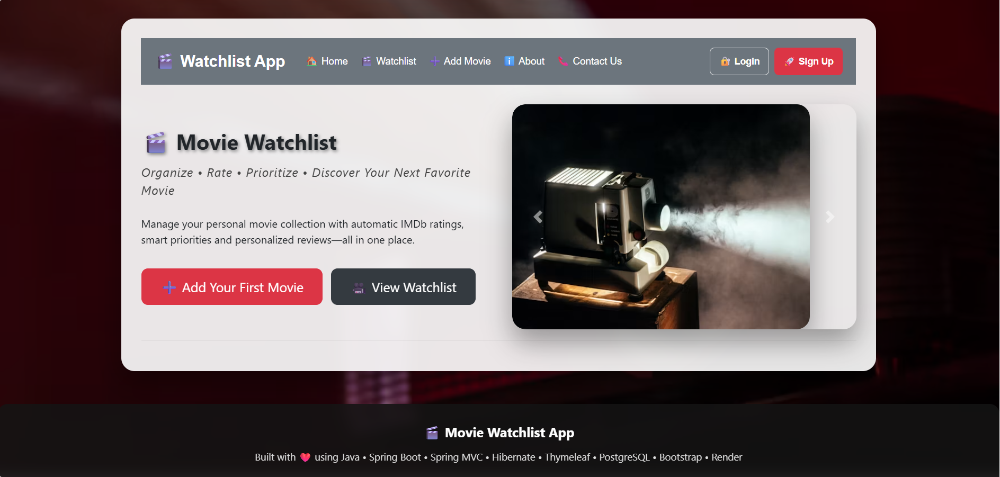 | 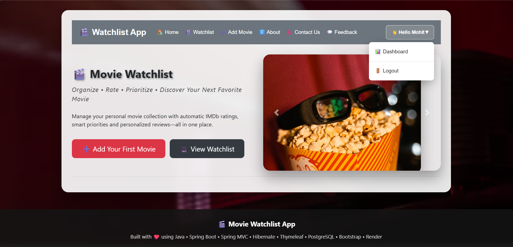 |
| **Public Home Page** | **Authenticated Home Page** |

---

### 🔐 Authentication

| Login | Signup |
|---|---|
| 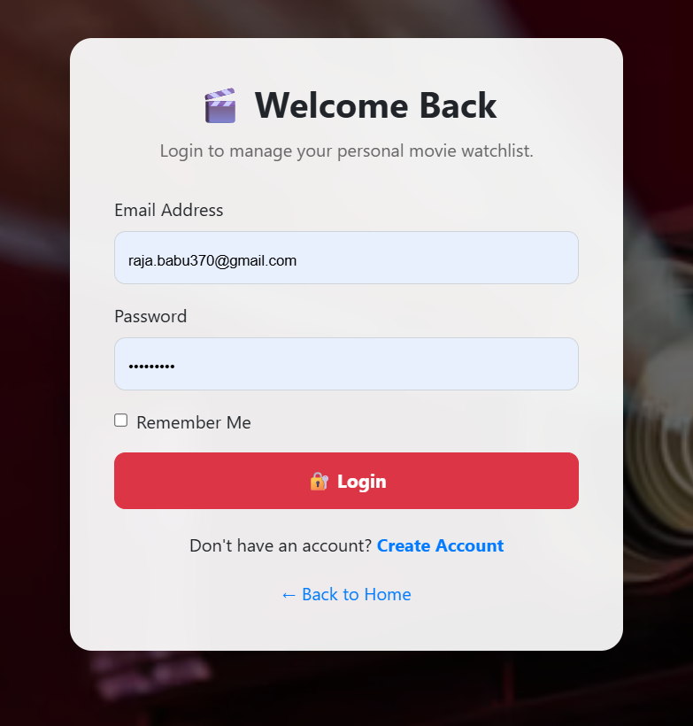 | 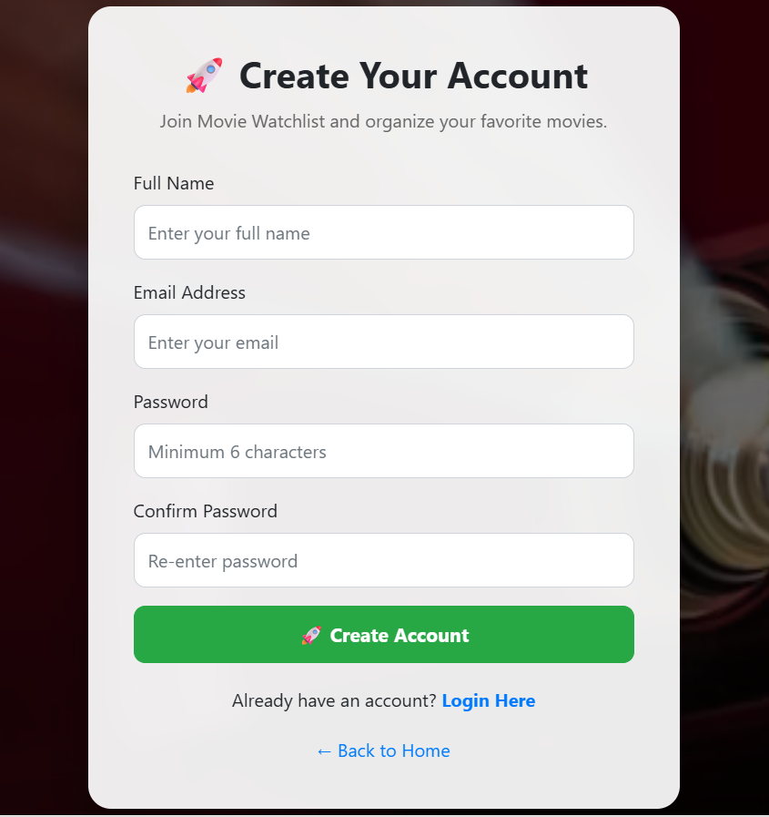 |
| **Login Page** | **Signup Page** |

---

### 🎬 Movie Management

| Watchlist | Submit Movie |
|---|---|
| 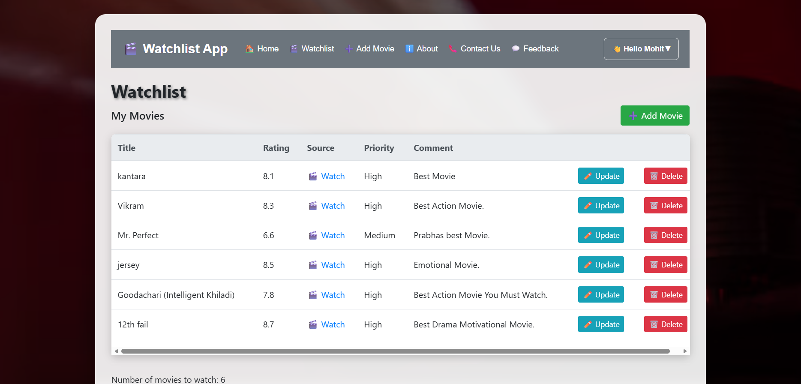 | 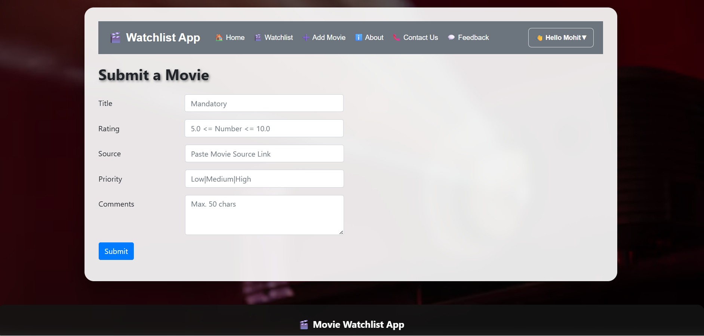 |
| **Movie Watchlist** | **Add / Submit Movie** |

---

### 📊 Dashboard

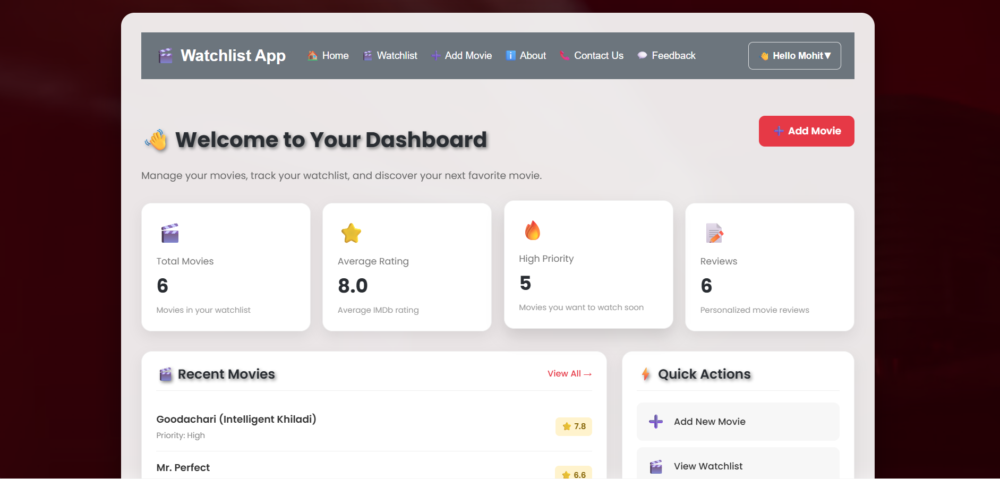

**User Dashboard**

---

### 📄 Information & Support

| About | Contact Us |
|---|---|
| 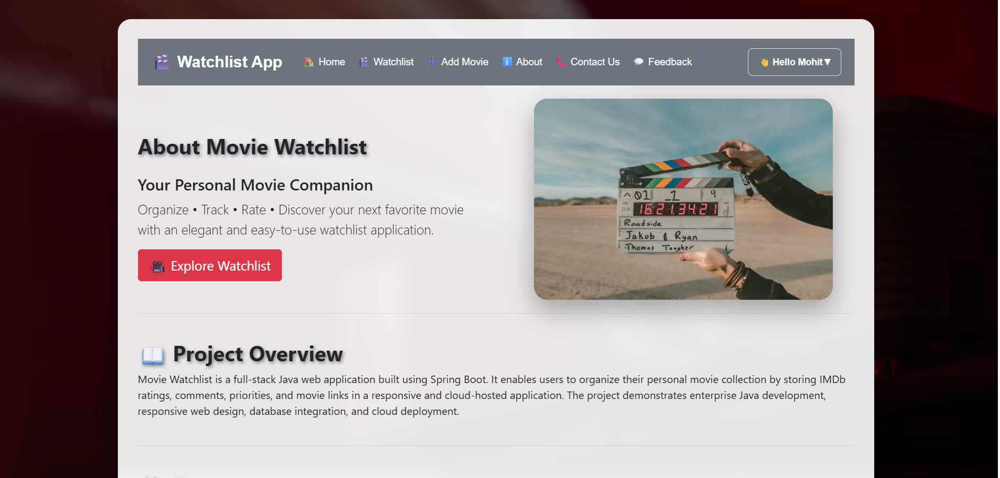 | 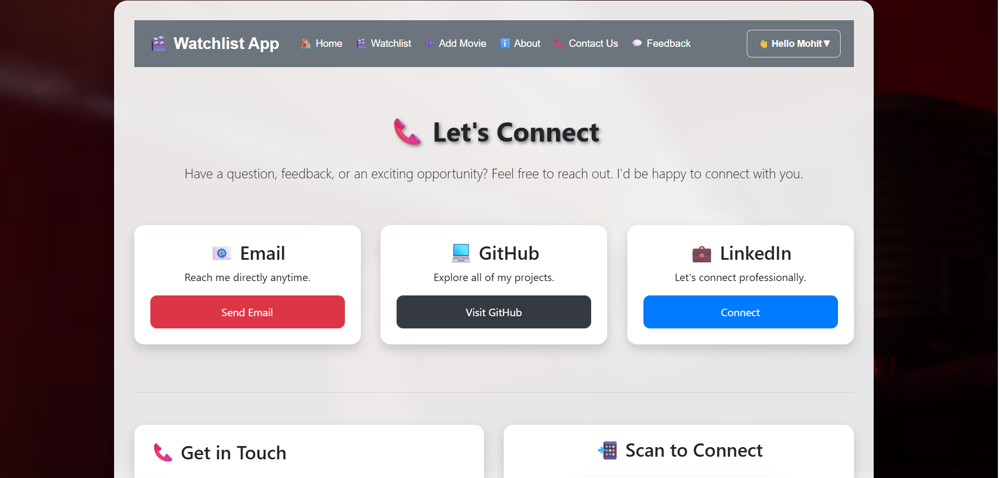 |
| **About Page** | **Contact Page** |

| Feedback | Footer |
|---|---|
| 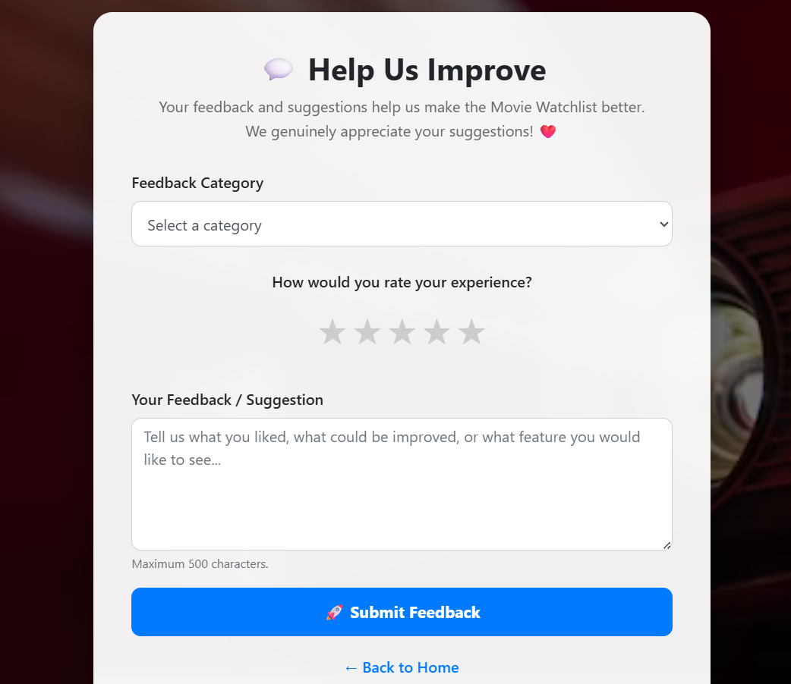 | 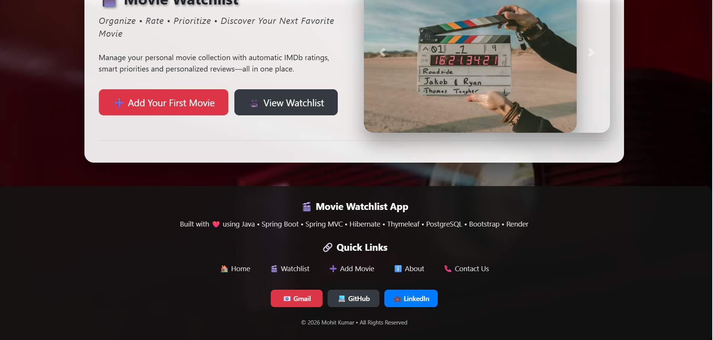 |
| **Feedback & Suggestions** | **Application Footer** |

---


## 🏗️ Application Architecture

The application follows the **MVC architecture** with separate layers for controllers, services, repositories, entities, DTOs, security, and validation.

```text
                         User
                          │
                          ▼
                  Thymeleaf Views
                          │
                          ▼
                     Controller
                          │
             ┌────────────┼────────────┐
             ▼            ▼            ▼
          Service      Security       DTO
             │            │
             ▼            ▼
        Repository   UserDetailsService
             │
             ▼
        JPA / Hibernate
             │
             ▼
       Database
```

**For movie rating:**


```text
MovieController
      │
      ▼
DatabaseService
      │
      ▼
RatingService
      │
      ▼
OMDb API
```


**For dashboard:**

```text
DashboardController
      │
      ▼
DashboardService
      │
      ▼
MovieRepo
      │
      ▼
User's Movies
```

---

# 📂 Project Structure

The complete project structure and package/file explanations are available here:

👉 **[View Detailed Project Structure](STRUCTURE.md)**

```text
Movie-Watchlist-App/
│
├── src/
├── pom.xml
├── README.md
├── WORKING.md
└── STRUCTURE.md
```


# 🛠 Technology Stack

## Backend

- Java
- Spring Boot
- Spring MVC
- Spring Security
- Spring Data JPA
- Hibernate ORM
- Jakarta Validation

---

## Frontend

- HTML5
- CSS3
- Thymeleaf
- Bootstrap 4
- JavaScript

---

## Database

- H2 Database Development Phase
- MySQL (Development)
- PostgreSQL (Production Ready)
- Spring Data JPA
- Hibernate

---

## External API

- OMDb REST API

---

## Validation

- Jakarta Bean Validation
- Custom Validation Annotation

---

## Build Tool

- Maven

---

## Development Tools

- Spring Tools
- Eclipse IDE
- Git
- GitHub

---

# 🔄 Application Workflow

## 1️⃣ User Registration

```text
Signup Page
     │
     ▼
SignupRequest DTO
     │
     ▼
AuthController
     │
     ▼
UserService
     │
     ▼
PasswordEncoder
     │
     ▼
UserRepo
     │
     ▼
Database
```

---


## 2️⃣ User Login

```text
Login Page
     │
     ▼
Spring Security
     │
     ▼
CustomUserDetailsService
     │
     ▼
UserRepo
     │
     ▼
CustomUserDetails
     │
     ▼
Authentication Successful
     │
     ▼
Dashboard
```

---

## 3️⃣ Add Movie

```text
Add Movie Form
      │
      ▼
MovieController
      │
      ▼
DatabaseService
      │
      ▼
RatingService
      │
      ▼
OMDb API
      │
      ▼
Rating / Manual Rating
      │
      ▼
Priority
      │
      ▼
MovieRepo
      │
      ▼
Database
```

---

## 4️⃣ Dashboard

```text
Login
  │
  ▼
DashboardController
  │
  ▼
DashboardService
  │
  ▼
MovieRepo
  │
  ├── Total Movies
  ├── Average Rating
  ├── High Priority Movies
  ├── Review Count
  └── Recent Movies
```

---

## 5️⃣ Feedback

```text
Authenticated User
       │
       ▼
Feedback Page
       │
       ▼
FeedbackController
       │
       ▼
FeedbackRepo
       │
       ▼
Database
```

---

# 🗄 Database

The application uses **Spring Data JPA and Hibernate** for database interaction.

The application can be configured to use:

- H2 Database for development/testing
- PostgreSQL for persistent database storage

Database entities include:

```text
User
Movie
Feedback
```

The `Movie` entity is associated with a user so that each authenticated user can manage their own watchlist.


---

## 🌐 Application URLs

### Home

```text
http://localhost:8080/
```

### Login

```text
http://localhost:8080/login
```

### Signup

```text
http://localhost:8080/signup
```

### Dashboard

```text
http://localhost:8080/dashboard
```

### Watchlist

```text
http://localhost:8080/watchlist
```

### Add Movie

```text
http://localhost:8080/watchlistItemForm
```

### About

```text
http://localhost:8080/about
```

### Contact

```text
http://localhost:8080/contact
```

### Feedback

```text
http://localhost:8080/feedback
```

---


## 🌐 OMDb API

The application uses the **OMDb API** to retrieve movie information and IMDb ratings.

Example request:

```text
https://www.omdbapi.com/?apikey=YOUR_API_KEY&t=Avatar
```

> Replace `YOUR_API_KEY` with your own OMDb API key.

For security, API keys should not be hard-coded into publicly shared source code.

---

# 📦 Maven Dependencies

The project uses Maven for dependency management.

Main dependencies include:

- Spring Boot Starter Web
- Spring Boot Starter Thymeleaf
- Spring Boot Starter Security
- Spring Boot Starter Validation
- Spring Boot Starter Data JPA
- Hibernate
- H2 Database
- PostgreSQL Driver
- Thymeleaf Extras Spring Security
- Jackson

---

## 🚀 Installation & Setup

### 1. Clone the Repository

```bash
git clone https://github.com/mohit-singhoi/Movie-Watchlist-App.git
```

### 2. Open the Project

Open the project using:

```text
Eclipse
IntelliJ IDEA
VS Code
```

### 3. Configure Database

Update the database configuration inside:

```text
src/main/resources/application.properties
```

Configure your database URL, username, and password.

### 4. Configure OMDb API

Add your OMDb API key to the application configuration.

Do not expose private API keys in GitHub.

### 5. Run the Application

Using the main class:

```text
WatchlistApplication.java
```

Or using Maven:

```bash
mvn spring-boot:run
```

### 6. Open the Application

```text
http://localhost:8080/
```

---

## 🔒 Security

The application uses **Spring Security** for authentication and authorization.

Security features include:

- Login authentication
- User registration
- Password encoding
- Protected dashboard
- Authenticated feedback
- User-specific movie data
- Custom `UserDetailsService`

---

## 📊 Dashboard Statistics

The dashboard calculates statistics from the logged-in user's movies.

| Statistic | Description |
|-----------|-------------|
| 🎬 Total Movies | Total movies in user's watchlist |
| ⭐ Average Rating | Average rating of rated movies |
| 🔥 High Priority | Number of high-priority movies |
| 📝 Reviews | Number of movies containing comments |
| 🎬 Recent Movies | Latest movies in watchlist |

---


## 📚 Project Documentation

Additional project documentation is maintained separately.

📖 [README.md](README.md) — Project overview and setup

Provides:

- Project overview
- Features
- Architecture
- Technology stack
- Installation
- Application workflow
- Package responsibilities


⚙️ [WORKING.md](WORKING.md) — Step-by-step application workflow

Explains **how the complete application works step-by-step**, from registration/login through movie management, dashboard, API integration, database operations, and feedback.


🏗️ [STRUCTURE.md](STRUCTURE.md) — Project structure and package explanation

Explains the **project structure and purpose of packages/files** without describing the complete application workflow.

---

## 🔮 Future Enhancements

Possible future improvements:

- ❤️ Favorite Movies
- 🎭 Movie Genres
- 🔎 Advanced Movie Search
- 📄 Pagination
- 📊 Advanced Sorting
- 🎬 Movie Posters
- 🎥 Trailer Integration
- ⭐ Detailed User Reviews
- 🔔 Notifications
- ☁ Cloud Deployment
- 🐳 Docker Support
- 🌐 REST API Version
- 📱 Mobile-Friendly Improvements
- 📈 Advanced Dashboard Analytics
- 🎞️ Movie Recommendation System

---


# 👨‍💻 Developed By

## Mohit Kumar

**MCA Student | Java Full Stack Developer | Spring Boot Developer**

📧 Email: *[mohitsinghoi501@gmail.com](mailto\:mohitsinghoi501@gmail.com)*

🔗 LinkedIn: *[https://www.linkedin.com/in/mohit-kumar-0379gu](https://www.linkedin.com/in/mohit-kumar-0379gu)*

### Skills

- Java
- Spring Boot
- Spring MVC
- Spring Data JPA
- Hibernate
- SQL
- HTML
- CSS
- Bootstrap
- REST APIs
- Git & GitHub

---

# 📄 License

This project is licensed under the **MIT License**.

---

# ⭐ Support

If you like this project, consider giving it a ⭐ on GitHub.

It motivates me to build more open-source Java and Spring Boot projects.

Happy Coding.....! 🚀 like this and update some section that is updated in this project
