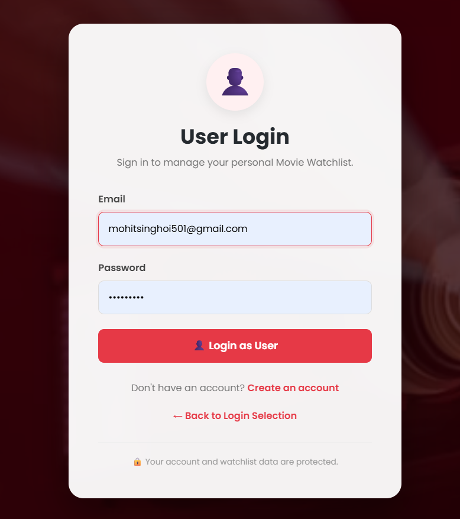
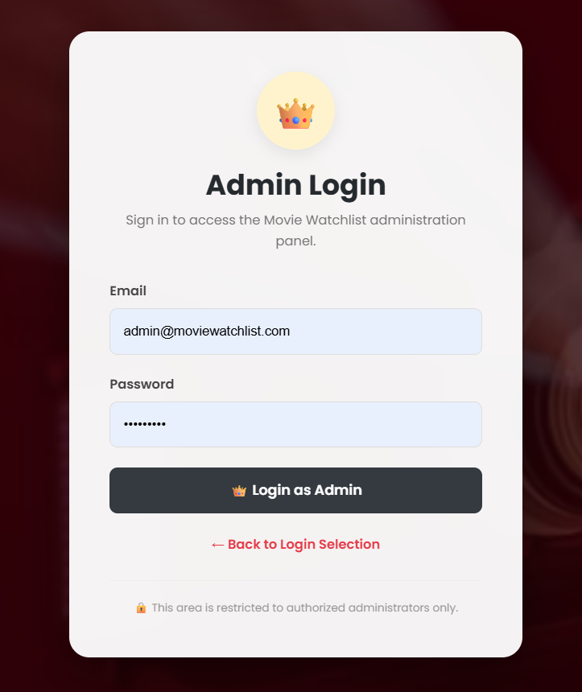

# 🎬 Movie Watchlist App

<p align="center">


</p>

A **full-stack Movie Watchlist Management System** built using **Java, Spring Boot, Spring MVC, Spring Security, Thymeleaf, Spring Data JPA, Hibernate, PostgreSQL, JavaScript, CSS, and the OMDb API**.

The application allows authenticated users to manage their personal movie watchlists while providing administrators with a complete management dashboard for users, movies, feedback, activities, and email communication.

---

# 📖 Project Overview

**Movie Watchlist App** is a Java-based full-stack web application designed to help users maintain and manage their personal movie collections.

Users can:

* Create an account
* Securely log in
* Add movies to their watchlist
* Automatically retrieve IMDb ratings
* Manually provide movie information when required
* Set movie priority
* Add comments
* Update movie information
* Delete movies
* View personalized dashboard statistics
* Submit feedback and suggestions

The application also includes a dedicated **Admin Panel** where administrators can manage users, movies, feedback, activities, and email communication.

The project follows the **MVC architecture** and uses a layered backend structure consisting of:

```text
Controller
    ↓
Service
    ↓
Repository
    ↓
JPA / Hibernate
    ↓
PostgreSQL
```

---

# ✨ Features

## 🔐 1. Spring Security Authentication & Roles

The application uses **Spring Security** to protect application resources and control access based on user roles.

### Authentication Features

* User Registration
* User Login
* Secure Password Encoding
* Logout
* Authentication-based page protection
* Custom `UserDetails`
* Custom `UserDetailsService`
* Custom Authentication Success Handler
* Role-based access control

### Roles

```text
USER
ADMIN
```

Users and administrators are provided with different access levels and dashboards.

---

# 👤 2. User Features

Authenticated users can manage their own movie watchlist.

### User functionality

* 👤 Create account
* 🔐 Login
* 🚪 Logout
* 🎬 Add movies
* 👀 View watchlist
* ✏️ Update movies
* 🗑️ Delete movies
* ⭐ Manage ratings
* 🚦 Manage priorities
* 📝 Add comments
* 🔗 Store movie source
* 📊 View dashboard
* 💬 Submit feedback
* 📈 View personalized statistics

Each user's movie data is associated with their account.

---

# 🎬 3. Movie Watchlist Management

Users can perform complete CRUD operations on movies.

| Operation  | Description        |
| ---------- | ------------------ |
| ➕ Create   | Add a movie        |
| 👀 Read    | View watchlist     |
| ✏️ Update  | Edit movie details |
| 🗑️ Delete | Remove movie       |

Movie information includes:

* Movie title
* IMDb rating
* Priority
* Comment
* Source

---

# ⭐ 4. OMDb API / IMDb Rating Integration

The application integrates with the **OMDb API** to retrieve movie information and IMDb ratings.

### Movie flow

```text
User enters movie title
        ↓
MovieController
        ↓
MovieService
        ↓
RatingService
        ↓
OMDb API
        ↓
IMDb Rating
        ↓
Save Movie
        ↓
PostgreSQL
```

If the movie cannot be found through OMDb, the application supports manual movie information.

### Manual support

Users can manually provide:

* Rating
* Priority
* Comment
* Source

This ensures that users can still add movies even when external API information is unavailable.

---

# 🚦 5. Priority Management

Movies can have different priority levels:

```text
L → Low
M → Medium
H → High
```

Custom validation is implemented using Jakarta Bean Validation.

Custom validation classes include:

```text
Priority.java
PriorityAnnotationLogic.java
Rating.java
RatingAnnotationLogic.java
```

---

# 📊 6. User Dashboard

The user dashboard provides a quick overview of the user's watchlist.

### Dashboard statistics

* 🎬 Total Movies
* ⭐ Average Rating
* 🔥 High Priority Movies
* 📝 Movies with Reviews
* 🎞️ Recent Movies

### Quick actions

* Add Movie
* View Watchlist
* About
* Contact
* Feedback

---

# 💬 7. Feedback System

Authenticated users can submit feedback and suggestions through the application's feedback section.

Users can provide:

* Feedback category
* Rating
* Message

Feedback is associated with the logged-in user.

### Feedback flow

```text
Authenticated User
        ↓
Feedback Form
        ↓
FeedbackController
        ↓
FeedbackService
        ↓
FeedbackRepo
        ↓
PostgreSQL
```

The application also displays success/error popup messages after feedback operations.

---

# 👨‍💼 8. Admin Panel

The application includes a dedicated administrator interface.

### Admin capabilities

* 📊 Admin Dashboard
* 👥 View Users
* 👤 View User Details
* 🎬 View User Movies
* 💬 View Feedback
* 📜 View Activities
* 📧 Respond to Feedback
* 📜 View Email Response History
* 🗑️ Delete Movies
* 🗑️ Delete Feedback
* 🗑️ Delete Activities
* 🗑️ Completely Delete Users

The Admin Panel provides centralized management of application data.

---

# 📧 9. Admin Email Response

Administrators can respond directly to users through email.

### Email response flow

```text
Admin opens Feedback
        ↓
Writes Response
        ↓
FeedbackController
        ↓
EmailService
        ↓
Gmail SMTP
        ↓
User Email
```

The application uses **Spring Mail / Jakarta Mail** for sending email responses.

Email authentication is configured using an **application-specific password** rather than a normal Gmail password.

---

# 📜 10. Email Response History

Every successful administrator response is stored in the database.

The response history contains:

* Response ID
* Feedback ID
* Admin email
* Response message
* Email status
* Response date and time

### Response history flow

```text
Admin sends response
        ↓
EmailService
        ↓
Email successfully sent
        ↓
FeedbackResponseService
        ↓
FeedbackResponseRepository
        ↓
PostgreSQL
```

The administrator can view previous responses directly from the **Feedback Details** page.

Example:

```text
📜 Email Response History

SENT
14 Aug 2026, 08:30 PM

📧 Admin:
supportmoviewatchlist@gmail.com

💬 Response:
Thank you for your valuable feedback...
```

This provides an audit trail of communication between the administrator and users.

---

# 📊 11. Activity Tracking

The application records important user activities.

Activities can include:

* User feedback submission
* Movie-related actions
* Other application events

Activities are associated with users and displayed through the Admin Panel.

### Activity structure

```text
User
 ↓
Activity
 ↓
ActivityService
 ↓
ActivityRepository
 ↓
PostgreSQL
```

Administrators can view:

* Activity list
* Activity details
* User associated with the activity
* Activity date/time

---

# 🗑️ 12. Complete User Deletion

The Admin Panel supports complete user deletion.

When an administrator deletes a user, associated data is handled before removing the user account.

The deletion workflow covers:

```text
User
 ├── Movies
 ├── Feedback
 │     └── Feedback Responses
 └── Activities
```

The application handles dependent records to maintain database referential integrity.

### Complete deletion flow

```text
Admin
 ↓
Delete User
 ↓
Delete Movies
 ↓
Delete Feedback Responses
 ↓
Delete Feedback
 ↓
Delete Activities
 ↓
Delete User
 ↓
PostgreSQL
```

A confirmation dialog is displayed before permanent deletion.

A success popup is displayed after successful deletion.

---

# 🧩 13. Reusable Thymeleaf Fragments

The application uses reusable Thymeleaf fragments for common UI elements.

### User Navbar

```html
<div th:replace="~{fragments/navbar :: navbar}"></div>
```

### User Footer

```html
<div th:replace="~{fragments/footer :: footer}"></div>
```

The Admin Panel also contains reusable administrator navigation and footer components.

This improves consistency and reduces duplicate HTML code.

---

# 🏗️ 14. MVC / Project Architecture

The application follows the **Model-View-Controller architecture** with a layered backend design.

```text
                         User
                           │
                           ▼
                    Thymeleaf Views
                           │
                           ▼
                      Controller
                           │
                           ▼
                        Service
                           │
                           ▼
                      Repository
                           │
                           ▼
                    Spring Data JPA
                           │
                           ▼
                       Hibernate
                           │
                           ▼
                      PostgreSQL
```

### Security layer

```text
Login
  ↓
Spring Security
  ↓
CustomUserDetailsService
  ↓
UserRepo
  ↓
CustomUserDetails
  ↓
Authentication
  ↓
Role-Based Access
```

### External API layer

```text
MovieController
      ↓
MovieService
      ↓
RatingService
      ↓
OMDb API
```

### Email layer

```text
FeedbackController
      ↓
EmailService
      ↓
Gmail SMTP
      ↓
User Email

      +

FeedbackResponseService
      ↓
FeedbackResponseRepository
      ↓
PostgreSQL
```

---

# 📁 15. Project Structure

```text
Movie-Watchlist-App/
│
├── src/
│   ├── main/
│   │   ├── java/
│   │   │   └── com/example/mohit/watchlist/
│   │   │
│   │   │       ├── WatchlistApplication.java
│   │   │       │
│   │   │       ├── config/
│   │   │       │   ├── SecurityConfig.java
│   │   │       │   └── PasswordConfig.java
│   │   │       │
│   │   │       ├── controller/
│   │   │       │   ├── HomeController.java
│   │   │       │   ├── AuthController.java
│   │   │       │   ├── DashboardController.java
│   │   │       │   ├── MovieController.java
│   │   │       │   ├── UserController.java
│   │   │       │   ├── FeedbackController.java
│   │   │       │   └── AdminController.java
│   │   │       │
│   │   │       ├── dto/
│   │   │       │   ├── LoginRequest.java
│   │   │       │   └── SignupRequest.java
│   │   │       │
│   │   │       ├── entity/
│   │   │       │   ├── User.java
│   │   │       │   ├── Movie.java
│   │   │       │   ├── Feedback.java
│   │   │       │   ├── Activity.java
│   │   │       │   └── FeedbackResponse.java
│   │   │       │
│   │   │       ├── repository/
│   │   │       │   ├── UserRepo.java
│   │   │       │   ├── MovieRepo.java
│   │   │       │   ├── FeedbackRepo.java
│   │   │       │   ├── ActivityRepo.java
│   │   │       │   └── FeedbackResponseRepository.java
│   │   │       │
│   │   │       ├── service/
│   │   │       │   ├── MovieService.java
│   │   │       │   ├── DashboardService.java
│   │   │       │   ├── RatingService.java
│   │   │       │   ├── UserService.java
│   │   │       │   ├── FeedbackService.java
│   │   │       │   ├── ActivityService.java
│   │   │       │   ├── FeedbackResponseService.java
│   │   │       │   └── EmailService.java
│   │   │       │
│   │   │       ├── security/
│   │   │       │   ├── CustomUserDetails.java
│   │   │       │   ├── CustomUserDetailsService.java
│   │   │       │   └── CustomAuthenticationSuccessHandler.java
│   │   │       │
│   │   │       └── validations/
│   │   │           ├── Priority.java
│   │   │           ├── Rating.java
│   │   │           ├── PriorityAnnotationLogic.java
│   │   │           └── RatingAnnotationLogic.java
│   │   │
│   │   └── resources/
│   │       ├── static/
│   │       │   ├── css/
│   │       │   ├── js/
│   │       │   └── Images/
│   │       │
│   │       ├── templates/
│   │       │   ├── fragments/
│   │       │   ├── admin/
│   │       │   ├── auth/
│   │       │   ├── dashboard.html
│   │       │   ├── watchlist.html
│   │       │   ├── watchlistItemForm.html
│   │       │   ├── watchlistItem.html
│   │       │   ├── about.html
│   │       │   ├── contact.html
│   │       │   └── feedback.html
│   │       │
│   │       └── application.properties
│   │
│   └── test/
│
├── pom.xml
├── README.md
├── WORKING.md
└── STRUCTURE.md
```

For detailed package and file responsibilities, see:

👉 **[STRUCTURE.md](STRUCTURE.md)**

---

# 🛠️ 16. Technology Stack

## Backend

* Java
* Spring Boot
* Spring MVC
* Spring Security
* Spring Data JPA
* Hibernate ORM
* Jakarta Bean Validation
* Spring Mail

## Frontend

* HTML5
* CSS3
* JavaScript
* Thymeleaf
* Bootstrap

## Database

* PostgreSQL
* Spring Data JPA
* Hibernate

## External Services

* OMDb API
* Gmail SMTP

## Build & Development Tools

* Maven
* Git
* GitHub
* Eclipse / Spring Tools
* PostgreSQL
* Apache Tomcat

---

# 🗄️ 17. PostgreSQL Database

The application uses **PostgreSQL** as the primary persistent database.

Hibernate and Spring Data JPA handle database interaction.

### Main entities

```text
users
movies
feedback
activities
feedback_responses
```

### Main relationships

```text
User
 ├── Movies
 ├── Feedback
 └── Activities

Feedback
 └── FeedbackResponses
```

`FeedbackResponse` maintains a relationship with `Feedback`, allowing multiple email responses to be stored for a single feedback entry.

---

# ⚙️ 18. Environment Configuration

Sensitive configuration should not be committed directly to GitHub.

Recommended configuration includes:

```properties
# PostgreSQL
spring.datasource.url=${DB_URL}
spring.datasource.username=${DB_USERNAME}
spring.datasource.password=${DB_PASSWORD}

# OMDb
omdb.api.key=${OMDB_API_KEY}

# Email
spring.mail.username=${MAIL_USERNAME}
spring.mail.password=${MAIL_APP_PASSWORD}
```

### Required environment variables

```text
DB_URL
DB_USERNAME
DB_PASSWORD
OMDB_API_KEY
MAIL_USERNAME
MAIL_APP_PASSWORD
```

For Gmail SMTP authentication, use a **Google App Password** rather than your normal Gmail account password.

> ⚠️ Never commit database passwords, API keys, Gmail passwords, or App Passwords to GitHub.

---

# 🚀 19. Installation & Running

## 1. Clone Repository

```bash
git clone https://github.com/mohit-singhoi/Movie-Watchlist-App.git
```

```bash
cd Movie-Watchlist-App
```

---

## 2. Configure PostgreSQL

Make sure PostgreSQL is installed and running.

Create a database for the application.

Example:

```sql
CREATE DATABASE moviewatchlist;
```

---

## 3. Configure Environment Variables

Set the required database, OMDb, and email configuration.

```text
DB_URL
DB_USERNAME
DB_PASSWORD
OMDB_API_KEY
MAIL_USERNAME
MAIL_APP_PASSWORD
```

---

## 4. Build the Project

Using Maven:

```bash
mvn clean install
```

---

## 5. Run the Application

```bash
mvn spring-boot:run
```

Or run:

```text
WatchlistApplication.java
```

from Eclipse, Spring Tools, IntelliJ IDEA, or another compatible IDE.

---

## 6. Open Application

```text
http://localhost:8080/
```

---

# 🔗 20. Important URLs

## Public/User Pages

| Page         | URL                                       |
| ------------ | ----------------------------------------- |
| 🏠 Home      | `http://localhost:8080/`                  |
| 🔐 Login     | `http://localhost:8080/login`             |
| 📝 Signup    | `http://localhost:8080/signup`            |
| 📊 Dashboard | `http://localhost:8080/dashboard`         |
| 🎬 Watchlist | `http://localhost:8080/watchlist`         |
| ➕ Add Movie  | `http://localhost:8080/watchlistItemForm` |
| ℹ️ About     | `http://localhost:8080/about`             |
| 📞 Contact   | `http://localhost:8080/contact`           |
| 💬 Feedback  | `http://localhost:8080/feedback`          |

## Admin Pages

The Admin Panel contains dedicated pages for:

```text
Admin Dashboard
Users
User Details
Movies
Movie Details
Feedback
Feedback Details
Activities
Activity Details
```

Administrative routes are protected by Spring Security and role-based authorization.

---

# 🔄 21. Complete Application Workflow

## 👤 User Registration

```text
Signup
  ↓
SignupRequest
  ↓
AuthController
  ↓
UserService
  ↓
PasswordEncoder
  ↓
UserRepo
  ↓
PostgreSQL
```

## 🔐 User Login

```text
Login
  ↓
Spring Security
  ↓
CustomUserDetailsService
  ↓
UserRepo
  ↓
CustomUserDetails
  ↓
Authentication
  ↓
Dashboard
```

## 🎬 Add Movie

```text
Add Movie
  ↓
MovieController
  ↓
MovieService
  ↓
RatingService
  ↓
OMDb API
  ↓
IMDb Rating
  ↓
MovieRepo
  ↓
PostgreSQL
```

## 💬 Feedback

```text
User
  ↓
Feedback Form
  ↓
FeedbackController
  ↓
FeedbackService
  ↓
FeedbackRepo
  ↓
PostgreSQL
```

## 📧 Admin Response

```text
Admin
  ↓
Feedback Details
  ↓
Response Form
  ↓
FeedbackController
  ↓
EmailService
  ↓
Gmail SMTP
  ↓
User Email
  ↓
FeedbackResponseService
  ↓
FeedbackResponseRepository
  ↓
PostgreSQL
```

## 🗑️ Complete User Deletion

```text
Admin
  ↓
Delete User
  ↓
Delete Movies
  ↓
Delete Feedback Responses
  ↓
Delete Feedback
  ↓
Delete Activities
  ↓
Delete User
  ↓
PostgreSQL
```

---
# 📸 22. Application Screenshots

The following screenshots demonstrate the main pages and features of the Movie Watchlist Application.

---

### 🏠 Home Pages

| Before Login | After Login |
|---|---|
|  |  |
| **Public Home Page** | **Authenticated Home Page** |

---

### 🔐 Authentication

| Login | Signup |
|---|---|
|  |  |
| **Login Page** | **Signup Page** |

---

| User Login | AdminLogin |
|---|---|
|  |  |
| **User Login Page** | **Admin Login Page** |

---

### 🎬 Movie Management

| Watchlist | Submit Movie |
|---|---|
|  |  |
| **Movie Watchlist** | **Add / Submit Movie** |

---

### 📊 Dashboard


**User Dashboard**

---

### 📄 Information & Support

| About | Contact Us |
|---|---|
|  |  |
| **About Page** | **Contact Page** |

| Feedback | Footer |
|---|---|
|  |  |
| **Feedback & Suggestions** | **Application Footer** |

---


### 👨‍💼 Admin Panel

Add screenshots for:

* Admin Dashboard
* Users
* User Details
* Movies
* Feedback
* Feedback Details
* Email Response History
* Activities


---

# 📚 23. Project Documentation

Additional documentation is maintained separately.

### 📖 WORKING.md

[WORKING.md](WORKING.md)

Contains the detailed **step-by-step application workflow**, including:

* Registration
* Authentication
* Movie management
* Dashboard
* OMDb integration
* Feedback
* Admin operations
* Email response
* Response history
* User deletion

### 🏗️ STRUCTURE.md

[STRUCTURE.md](STRUCTURE.md)

Contains the detailed **project structure and package responsibilities**.

It explains the purpose of:

* Controllers
* Services
* Repositories
* Entities
* DTOs
* Security
* Validation
* Templates
* Static resources

---

# 🔒 24. Security

Security is implemented using Spring Security.

### Security features

* Password encoding
* Authentication
* Authorization
* Role-based access
* Protected user pages
* Protected admin pages
* User-specific movie data
* Custom UserDetails
* Custom UserDetailsService
* Custom authentication success handling

Sensitive configuration is stored through environment variables instead of being hard-coded.

---

# 📊 25. Dashboard Statistics

| Statistic         | Description                      |
| ----------------- | -------------------------------- |
| 🎬 Total Movies   | Total movies in user's watchlist |
| ⭐ Average Rating  | Average rating of rated movies   |
| 🔥 High Priority  | Number of high-priority movies   |
| 📝 Reviews        | Movies containing comments       |
| 🎞️ Recent Movies | Recently added movies            |

---

# 🔮 26. Future Enhancements

Possible future improvements include:

* ❤️ Favorite Movies
* 🎭 Movie Genres
* 🔎 Advanced Movie Search
* 📄 Pagination
* 📊 Advanced Sorting
* 🎬 Movie Posters
* 🎥 Trailer Integration
* ⭐ Detailed User Reviews
* 🔔 Notifications
* ☁️ Cloud Deployment
* 🐳 Docker Support
* 🌐 REST API
* 📱 Mobile Application
* 📈 Advanced Analytics
* 🤖 Movie Recommendation System

---

# 👨‍💻 Developer

## Mohit Kumar

**MCA Student | Java Full Stack Developer | Spring Boot Developer**

📧 Email: [mohitsinghoi501@gmail.com](mailto:mohitsinghoi501@gmail.com)

🔗 LinkedIn: [linkedin.com/in/mohit-kumar-0379gu](https://www.linkedin.com/in/mohit-kumar-0379gu)

🔗 GitHub: [github.com/mohit-singhoi](https://github.com/mohit-singhoi)

### Skills

* Java
* Spring Boot
* Spring MVC
* Spring Security
* Spring Data JPA
* Hibernate
* PostgreSQL
* SQL
* HTML
* CSS
* JavaScript
* Thymeleaf
* Bootstrap
* REST APIs
* Git & GitHub

---

# 📜 License

This project is licensed under the **MIT License**.

---

# ⭐ Support

If you find this project useful, consider giving it a ⭐ on GitHub.

It supports my learning journey and motivates me to build more Java and Spring Boot projects.

---

## 🚀 Final Note

**Movie Watchlist App** was developed as a practical Java Full Stack project to demonstrate:

* Spring Boot development
* MVC architecture
* Spring Security
* Database design
* JPA / Hibernate
* External API integration
* Email communication
* Role-based administration
* CRUD operations
* Validation
* Activity tracking
* Database relationships
* Full-stack application workflow

**Happy Coding! 🎬☕🚀**


